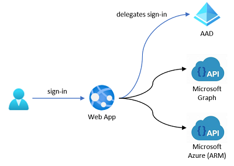
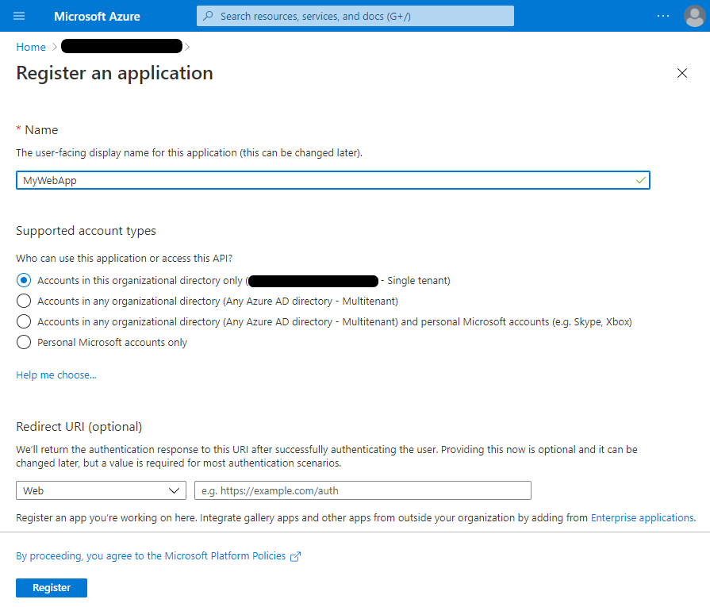
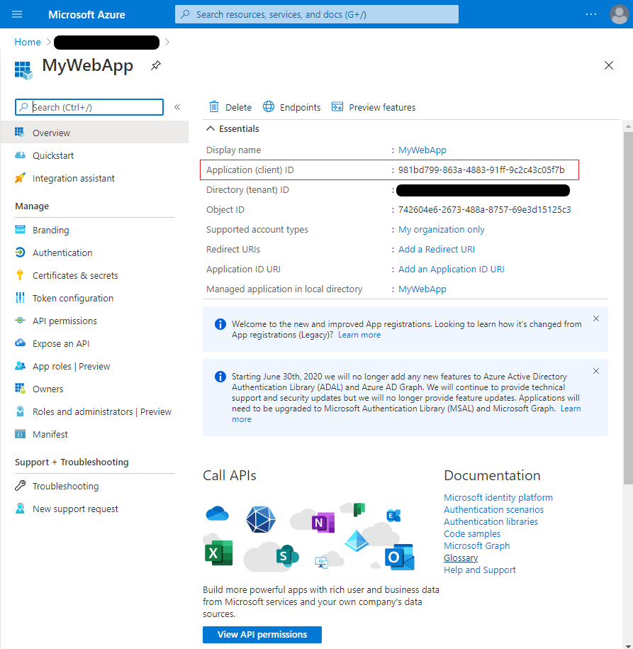
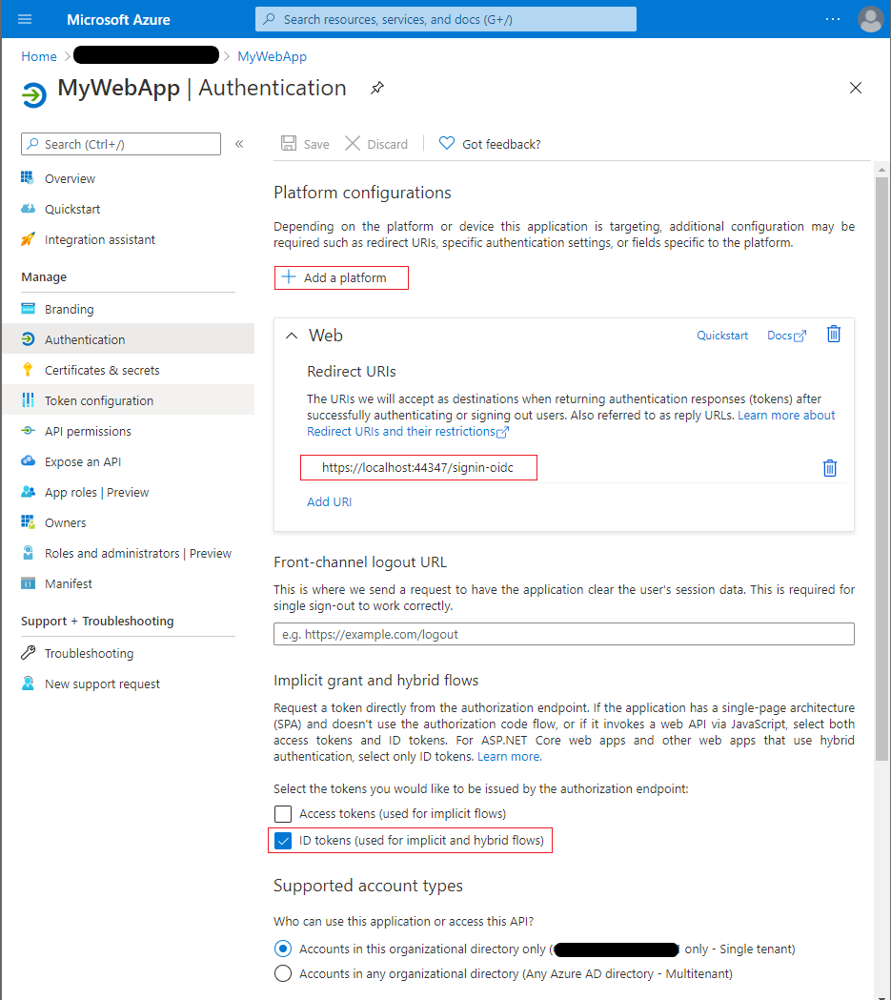
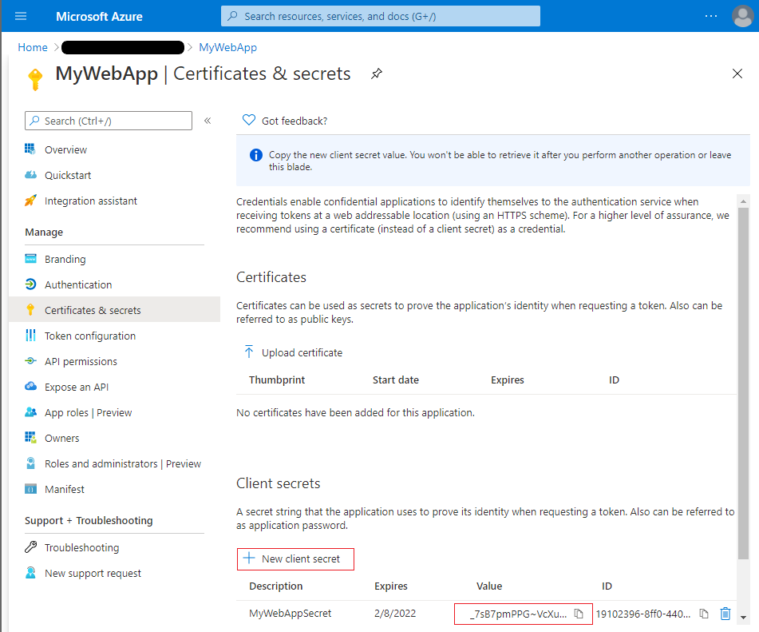
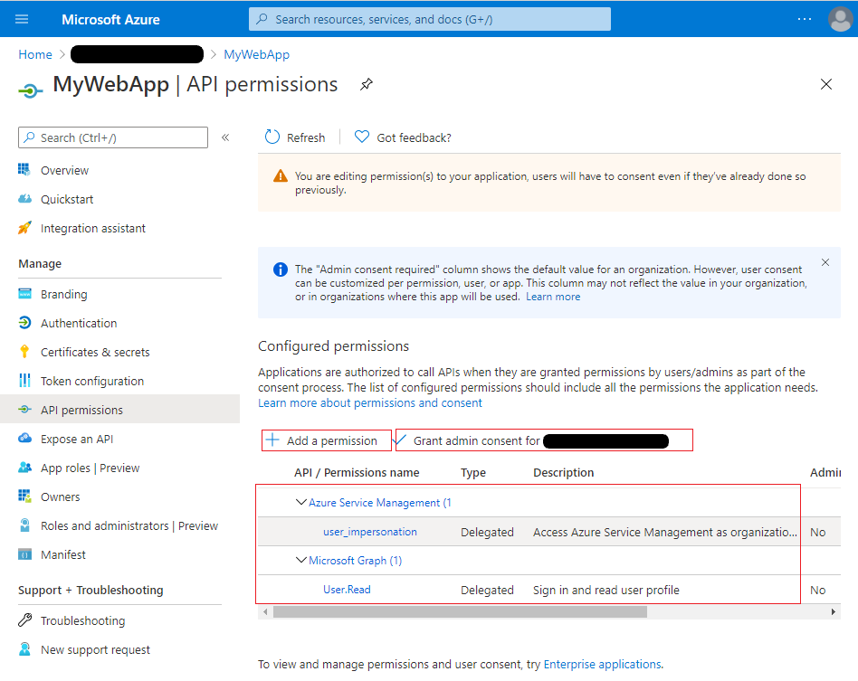

# Sample: Blazor Server Web App calls to Microsoft Graph and Azure Resource Manager (ARM)

## Scenario

This sample shows how to build a .NET Core Web App that calls Web APIs on behalf of signed-in user, specifically calls Microsoft Graph and Azure Resource Manager (ARM). Users can only sign-in with their work and school accounts in their own organization.

This sample uses Blazor Server Web App, however core concepts can be applied to any .NET Core Web App.

## How to run this sample

To run this sample:

>Pre-requisities: Install .NET 5.0 or later by following the instructions at [Download .NET](https://www.microsoft.com/net/core).

### Step 1: Register the sample with your Azure AD tenant

#### Choose the Azure AD tenant where you want to create your application

1. Sign in to the [Azure portal](https://portal.azure.com).
1. If your account is present in more than one Azure AD tenant, select your profile at the top right corner in the menu on top of the page, and then **switch directory**. Change your portal session to the desired Azure AD tenant.

#### Register the Web App

1. Navigate to the [App registrations](https://portal.azure.com/#blade/Microsoft_AAD_IAM/ActiveDirectoryMenuBlade/RegisteredApps) page
1. Select **New registration**.
1. When the **Register an application page** appears, enter your application's registration information:
   - In the **Name** section, enter application's name that will be displayed to users of the app, for example `MyWebApp`.
   - In the **Supported account types** section, select **Accounts in this organizational directory only (`MyTenant` - Single tenant)**.
   

   
Expand/collapse screenshot

     

   

1. Select **Register** to create the application.
1. On the app **Overview** page, find the **Application (client) ID** value and record it for later. You'll need it to configure the Visual Studio configuration file for this project.
   

   
Expand/collapse screenshot

     

   

1. In the list of pages for the app, select **Authentication**.
   - Select **Add a platform** and select **Web**.
   - In the Redirect URIs section enter the following redirect URIs:
       - `https://localhost:44347/`
       - `https://localhost:44347/signin-oidc`
   - In the **Implicit grant** section, check **ID tokens** as this sample requires
     the [ID Token](https://docs.microsoft.com/azure/active-directory/develop/id-tokens) to be enabled to
     sign-in the user.
   - Select **Configure**.
   

   
Expand/collapse screenshot

     

   

1. In the list of pages for the app, select **Certificates & secrets**.
   - In the **Client secrets** section, select **New client secret** and enter needed information.
   - Find the secret value and record it for later. You'll need it to configure the Visual Studio configuration file for this project.
   

   
Expand/collapse screenshot

     

   

1. In the list of pages for the app, select **API permissions**.
   - In the **Configured permissions** section, select **Add a permission**.
   - In the **Request API permissions** dialog, select **Azure Service Management** and check **user_impersonation** delegated permission.
   - Click on **Grant admin consent for `MyTenant`**.
   

   
Expand/collapse screenshot

     

   

### Step 2: Download/Clone this sample code
