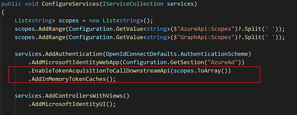

# Sample: Blazor Server Web App calls to Microsoft Graph and Azure Resource Manager (ARM)

## Scenario

This sample shows how to build a .NET Core Web App that calls Web APIs on behalf of signed-in user, specifically calls Microsoft Graph and Azure Resource Manager (ARM). Users can only sign-in with their work and school accounts in their own organization.

This sample uses Blazor Server Web App, however core concepts can be applied to any .NET Core Web App.


## How to run this sample

To run this sample:

>Pre-requisities: Install .NET 5.0 or later by following the instructions at [Download .NET](https://www.microsoft.com/net/core).

### Step 1: Register the sample with your Azure AD tenant

#### Choose the Azure AD tenant where you want to create your application

1. Sign in to the [Azure portal](https://portal.azure.com).
1. If your account is present in more than one Azure AD tenant, select your profile at the top right corner in the menu on top of the page, and then **switch directory**. Change your portal session to the desired Azure AD tenant.

#### Register the Web App

1. Navigate to the [App registrations](https://portal.azure.com/#blade/Microsoft_AAD_IAM/ActiveDirectoryMenuBlade/RegisteredApps) page
1. Select **New registration**.
1. When the **Register an application page** appears, enter your application's registration information:
    - In the **Name** section, enter application's name that will be displayed to users of the app, for example `MyWebApp`.
    - In the **Supported account types** section, select **Accounts in this organizational directory only (`{MyTenant}` - Single tenant)**.
    - Select **Register** to create the application.
    <details open=true>
    <summary>Expand/collapse screenshot</summary>

    

    </details>
1. On the app **Overview** page, find the **Application (client) ID** value and record it for later. You'll need it to configure the Visual Studio configuration file for this project.
    <details open=true>
    <summary>Expand/collapse screenshot</summary>

    

    </details>
1. In the list of pages for the app, select **Authentication**.
    - Select **Add a platform** and select **Web**.
    - In the Redirect URIs section enter the following redirect URIs:
        - `https://localhost:44347/`
        - `https://localhost:44347/signin-oidc`
    - In the **Implicit grant** section, check **ID tokens** as this sample requires
     the [ID Token](https://docs.microsoft.com/azure/active-directory/develop/id-tokens) to be enabled to
     sign-in the user.
    - Click **Configure**.
    <details open=true>
    <summary>Expand/collapse screenshot</summary>

    

    </details>
1. In the list of pages for the app, select **Certificates & secrets**.
    - In the **Client secrets** section, select **New client secret** and enter needed information.
    - Find the secret value and record it for later. You'll need it to configure the Visual Studio configuration file for this project.
    <details open=true>
    <summary>Expand/collapse screenshot</summary>

    

    </details>
1. In the list of pages for the app, select **API permissions**.
    - In the **Configured permissions** section, select **Add a permission**.
    - In the **Request API permissions** dialog, select **Azure Service Management** and check **user_impersonation** delegated permission.
    - **Microsoft Graph** and **User.Read** permission should be already configured, if not use **Request API permissions** to add it.
    - Click on **Grant admin consent for `{MyTenant}`**.
    <details open=true>
    <summary>Expand/collapse screenshot</summary>

    

    </details>

### Step 2: Download / clone this sample code or build the application using a template

This sample was created from the dotnet 5.0 new blazorserver template with SingleOrg authentication, and then modified to make calls to Microsoft Graph and Azure Resource Manager (ARM) APIs on behalf of signed-in user. You can clone/download this repository or create the sample from the command line:

#### Option 1: Download / clone this sample

You can clone this sample from your shell or command line:

  ```console
git clone https://github.com/grzegorzzygmunt/DemoArmGraphApp DemoArmGraphApp
cd DemoArmGraphApp
  ```

  In the **appsettings.json** file:
  
- replace the `<domain>` value with the *Azure AD domain name*,  e.g. mydomain.onmicrosoft.com where you registered your Application on *Step 1*.
- replace the `<tenant id>` value with the *Tenant ID* where you registered your Application on *Step 1* (see Azure Active Directory overview page).
- replace the `<application id>` value with the *Application ID* from the application you registered in Application Registration portal on *Step 1*.
- replace the `<application secret>` value with the *Client Secret* from the application you registered in Application Registration portal on *Step 1*.

#### Option 2: Create the sample from the command line

1. Run the following command to create a sample from the command line using the `SingleOrg` template:

    ```console
    dotnet new blazorserver -n DemoArmGraphApp --auth SingleOrg --client-id <YourAppId> --tenant-id <YourTenantId>
    cd DemoArmGraphApp
    ```

    > Note: Replace *`YourAppId`* with the *Application Id* from the application you just registered in the Application Registration Portal and *`<YourTenantId>`* with the *Directory (tenant) ID* where you created your application.

1. Open the generated project (.csproj) in Visual Studio, and save the solution.
1. Open the **appsettings.json** file and:
    - In the **AzureAd** section add **ClientSecret** setting and set it the *Client Secret* value from the application you registered in Application Registration portal on *Step 1*.
    - Add **AzureApi** and **GraphApi** sections (see below).

    

1. Open the **Startup.cs** file and in the `ConfigureServices` method add following code to enable token acquisition for downstream APIs.

    

1. For outgoing API calls that require user impersonation:
    - Get the token and pass it as a `Bearer` token in the **Authorization** header. See this example for outgoing calls to ARM.

        

    - Add authorization exception handing with **ConsentHandler** to refresh the token if needed.

        

### Step 3: Run the sample

1. Build the solution and run it.

2. Open your web browser and make a request to the app. Accept the IIS Express SSL certificate if needed. The app immediately attempts to authenticate you via the identity platform endpoint. Sign in with your work or school account.

3. If prompted, consent to the permissions requested by the appliation.

    
